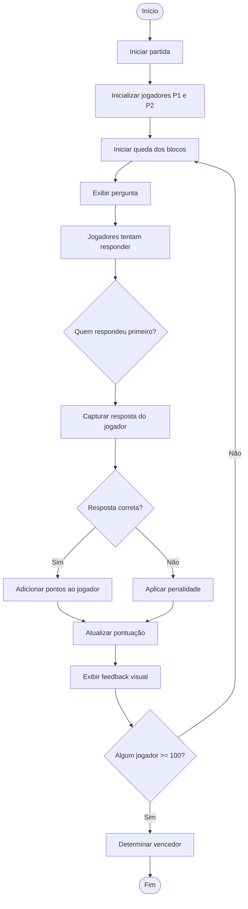

  

 

 

# Diagramas UML das Funcionalidades
Os <b>diagramas UML (Unified Modeling Language)</b> são representações visuais utilizadas para descrever, planejar e documentar sistemas de software. Eles permitem visualizar a estrutura e o comportamento da aplicação, facilitando o entendimento das funcionalidades e dos fluxos do sistema.

A utilização de diagramas UML é importante porque ajuda a organizar as ideias antes da implementação, melhora a comunicação entre os membros da equipe e garante maior clareza sobre como o sistema deve funcionar. Além disso, servem como documentação do projeto, permitindo que outras pessoas compreendam e contribuam com mais facilidade no desenvolvimento.

## Guia Rápido de Diagramas UML (Atividades)

| Formato da Forma | Descrição | Exemplo (o que ilustrar) |
|------------------|----------|--------------------------|
| 🔵 Círculo preenchido (Início) | Representa o ponto inicial do fluxo do sistema | Tela inicial do jogo sendo aberta |
| ⚫ Círculo com borda (Fim) | Indica o final de um fluxo ou processo | Fim de uma partida ou término de uma ação |
| ⬛ Retângulo (Ação) | Representa uma ação ou etapa executada no sistema | "Exibir pergunta", "Mover peça", "Validar resposta" |
| 🔷 Losango (Decisão) | Representa uma condição (if/else), onde o fluxo pode seguir caminhos diferentes | "Resposta correta?" ou "Colidiu?" |
| ➡️ Seta (Fluxo) | Indica a direção do fluxo entre as etapas | Ligação entre ações (ex: da pergunta para validação) |
| 🟦 Retângulo com borda dupla (Subprocesso - opcional) | Representa um processo mais complexo que pode ser detalhado em outro diagrama | "Processar pontuação" ou "Gerenciar lógica do jogo" |
| 🧍‍♂️ Swimlane (Raia - opcional) | Divide responsabilidades entre usuário e sistema | Separar ações do jogador e do sistema no diagrama |

# Diagrama dos BackLogs

## 1 . Jogar partida local

## 2. Sistema de queda de blocos

## 3. Perguntas de lógica durante o jogo

## 4. Sistema de pontuação

## 5. Penalidade por erro

## 6. Sistema de vitória

## 7. Sistema de tempo nas perguntas

## 8. Efeito competitivo (impactar adversário)

## 9. Interface do jogo (UI básica)

## 10. Banco de perguntas (fixo/local)

## 11. Aumento de dificuldade progressiva

## 12. Feedback visual (acerto/erro)

# Backlog do Sistema de Adivinhação

## 1. Sorteio do número secreto

## 2. Loop de adivinhação

## 3. Validação da entrada

## 4. Feedback: “Muito baixo”

## 5. Feedback: “Muito alto”

## 6. Feedback: “Acertou”

