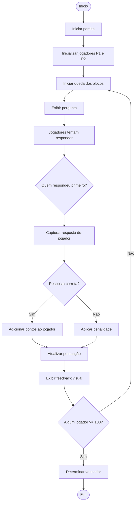

```mermaid
flowchart TD

A([Início]) --> B[Iniciar partida]
B --> C[Inicializar jogadores P1 e P2]
C --> D[Iniciar queda dos blocos]

D --> E[Exibir pergunta]

E --> F[Jogadores tentam responder]

F --> G{Quem respondeu primeiro?}

G --> H[Capturar resposta do jogador]

H --> I{Resposta correta?}

I -->|Sim| J[Adicionar pontos ao jogador]
I -->|Não| K[Aplicar penalidade]

J --> L[Atualizar pontuação]
K --> L

L --> M[Exibir feedback visual]

M --> N{Algum jogador >= 100?}

N -->|Não| D
N -->|Sim| O[Determinar vencedor]

O --> P([Fim])
```